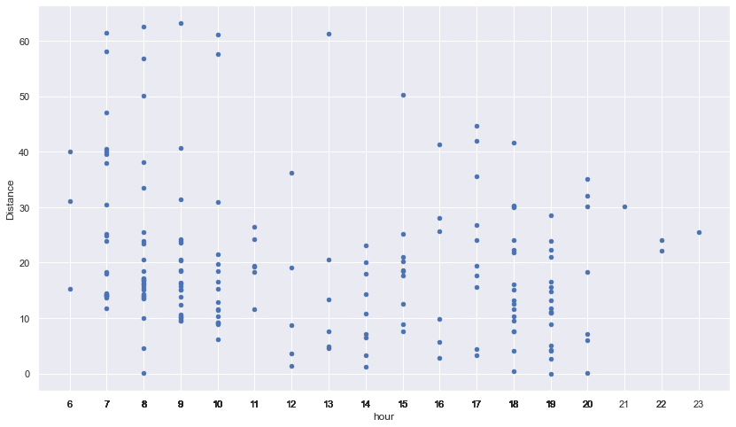

# Cycling Workout Prediction & Strava GPX Data Analysis

## Overview

I started cycling with a foldable bike at end of January 2020 and I felt in love with cycling. I also love working with data so I've recorded all my rides to [Strava](www.strava.com) with [Withings Steel HR](https://www.withings.com/us/en/steel-hr) smart watch. 🚴🏻🚴🏻

At the end of may I upgraded my city bike to a Gravel bike. I had great time with my new bike with outdoor activities until autumn.


After practicing outside with nice weather, for cold weather I setup a pain-cave at my home for virtual rides on [Zwift](www.zwift.com) using [Elite Arion AL13 roller](https://www.elite-it.com/en/products/home-trainers/rollers/arion) with [Misuro B+ sensor](https://www.elite-it.com/en/products/home-trainers/sensors/misuro-b). Zwift is a virtual environment where you connect with your 3D avatar to ride with other athletes real-time.


Also my Zwift account is also connected with Strava to collect all my ride data. I’ve completed **“3700km”** so far combining outdoor and indoor activities 🎉🎉

I've decided to analyze my data and after analyzing I've decided to take this to next level with my engineering capabilities.

This repo shows how to analyze your Strava data and visualize it on Jupyter Notebook. There's another aim for this project to predict workout days and distance to find your routine using your own data. You can use this digital personal trainer as a workout companion.

First this project started as data discovery of existing bulk data on Jupyter Notebook, during data exploration phase I saw some patterns and though that, these patterns can help me to get back to my shape again. Shortly after decided to build a predictive model to predict my workout, `ride type` and  `distance`, tried to find best possible fit for prediction. To use prediction model, exported as pickle file and serve that model in Python FastAPI then a chat bot on teams using the API helped me to provide some inputs and then retrieve prediction.


## Data Discovery - Highlights

Let's have a look at some highlights I achieved so far, here are some highlights about my data.

1. In 1 year I've completed around **3700 km** including outdoor and indoor workout activities. Around 1 of 3rd is virtual ride on Zwift.

    

2. In 2019 I gain some fat, so after my activities and healthy food as a result I lost ~13kgs (~28lbs) during this time.

    

3. I love this weekly graph showcasing all important life events happened in one year. Started with a passion then lockdown due to pandemic in Turkey, then enjoying riding then new year break challenge #Rapha500, then blessed with a new family member, then trying to find my old routine again, last but not least decided to build a personal trainer.

    

4. So far my longest distance in one ride is 62km, and I love this graph to show my performance over time.

    

## Correlation

While I was checking ride type over time, I realized that after a point I only switched to Virtual Ride and I wanted to correlate with `Wind` and `Temperature, I used a Weather API to retrieve Weather condition during my workouts and results were clear, I don't like cycling at cold, rainy weathers, so after a point I switched back to just Virtual Rides, and below graph shows that after a certain degree I picked Virtual Ride. This is one of the features, I have added into my model for prediction.


## Feature Engineering

I spent some time to visualize my ride data using Jupyter Notebook and I found some patterns. These patterns were either concious decisions by me or some decisions due to conditions.

I decided to do excercise on [Feature Engineering](https://en.wikipedia.org/wiki/Feature_engineering)

### 1. Ride Type

Ride type is a big factor for duration of the training and day of the training, so  I added a flag as if workout is a Outdoor Ride or Indoor Ride

* rideType - boolean flag

### 2. Weather Condition

As mentioned in [correlation](#correlation), weather is one of the feature that effects my workout plan:

* `Temperature` - Celsius value as integer
* `Wind` - km/h value as integer
* `Weather Description` - Description if weather is cloudy, sunny, rainy etc.

### 3. Day of the Week and Weekend

When I plot distance over if it's weekend or weekdays, my longest rides were on the weekend, also public holidays were another factor but for my model however I haven't integrated those for now, I will include these into model too

* `DayOfWeek` - integer

  

But mostly I picked Tuesday and Thursday as weekday short ride days, and decided to add week of the day as a feature and use weekends as flag based on below graph

* `isWeekend` - boolean flag

  

### 4. Hour of the Day

Especially for hot summer days I do prefer early outdoor rides where temperature is cooler than noon time. So based on my plot hour of the day is effecting my ride and ride type as well so decided to add a feature for hour of the day

* `hour` - integer

  

## Prediction Model Training

For my personal need and after data analysis I want to have prediction of my rides. I want to know `distance`, how many kilometers I'll ride and what will be the `ride type`, is it indoor ride or outdoor ride.

I did some data analysis and had feature engineering to have prediction for `Distance` and `Ride Type`.

### Ride Type Prediction

For mental preperation, there are differences between riding indoor and outdoor, so generally I do prepare myself and my ride equipments the day before for my workout based on my ride type. I do prefer going outside however I don't like rainy and cold weather as well so I want to find my optimum for the ride.

This choice is also effecting my distance and hour of workout.
It's a classification problem, so I have decided to pick `Logistic Regression` for predicting ride type.

### Distance Prediction

For weakly goals I set weekly distance goals to complete. To reach my target there are some out side factors such as at "what time of the day?", "How is the weather?", "Is it hot outside or cold outside?", "Is it windy?", "Is it weekend or weekday?"

After these questions I set my actual target, this is more like
`Regression` problem and I've decided to pick `Linear Regression` for distance prection.

For predicting **distance** and **ride type** I did a little bit feature engineering and pick some features. I below values effecting my ride type and distance as features for my model.

> `['hour','dayOfWeek','isWeekend','temp','wind','weather']`

I have decided to pick `Logistic Regression` for ride type and `Linear Regression` for distance. Of course there can be more accurate models, it's an iterative process and whenever I collect more ride data and correlate with more data I would like to improve prediction accuracy, so this is just start.

There is a nice [Machine Learning algorithm cheat sheet](https://docs.microsoft.com/en-us/azure/machine-learning/algorithm-cheat-sheet). You can learn more about ML algorithms and their applications.

## Models

Set training data with selected features

```python
# select features as list of array
X = data[['hour','dayOfWeek','isWeekend','temp','wind','weather']]
X = X.to_numpy()
X
```

Set prediction training data with results

```python
# set Distance values
Y_distance = data['Distance']
Y_distance = Y_distance.to_numpy()

# set Ride Type Values
Y_rideType = data['rideType']
Y_rideType = Y_rideType.to_numpy()
```

1. **Linear Regression for distance prediction**

    ```python
    # example of training a final regression model
    from sklearn.linear_model import LinearRegression

    # fit final model
    model = LinearRegression()
    model.fit(X[0:160], Y_distance[0:160])

    # make a prediction
    Xnew = X[160:167]
    ynew = model.predict(Xnew)

    # show the inputs and predicted outputs
    for i in range(len(Xnew)):
        j = 160
        print("X=%s, Predicted=%s, Actual Distance=%s, Actual Ride Type=%s" % (Xnew[i], ynew[i],Y_distance[j+i],Y_rideType[j+i]))
    ```

2. **Logistic Regression for RideType Prediction**

    ```python
    from sklearn.linear_model import LogisticRegression
    clf = LogisticRegression(random_state=0).fit(X, Y_rideType)
    result_ridetype = clf.predict([[8,6,1,20,3,0]])
    print("Result type prediction=%s" % result_ridetype)

    # test prediction
    result_ridetype = clf.predict([[8,6,1,10,12,1]])
    print("Result type prediction=%s" % result_ridetype)
    ```

3. **Export models as pickle file**

    ```python
    import pickle

    # Save to file in the model folder
    distance_model_file = "../web/model/distance_model.pkl"
    with open(distance_model_file, 'wb') as file:
        pickle.dump(model, file)
        
    ridetype_model_file = "../web/model/ridetype_model.pkl"
    with open(ridetype_model_file, 'wb') as file:
        pickle.dump(clf, file)
    ```

## Solution

This is end to end solution, using Strava workout data exports as input. Strava contains indoor and outdoor workout ride data. To analyse the data, Jupyter Notebook is used for `Data Cleaning`, `Data Pre-Processing`, `Model Training` and `Model Export. For machine learning model training and prediction scikit-learn is used. Prediction model is exported using scikit-learn to predict my ride type and distance of my workout.

Model, as a pickle file is hosted in a FastAPI, provides an API interface to pass parameters and predict weather information using 3rd party weather api and these values are used by model for prediction.

For user interaction interface, I've created a Conversational AI project using BotFramework to communicate with Fast API. I picked Microsoft Teams to use as canvas, since everyday I'm regularly using this platform to communicate.

With this solution now I can select my city, workout date and time, these selections provide weather forecast and use these parameters with my prediction model to provide `Distance` and `ride type` predictions.

### Architecture


Folder Structure:

* `bot` - Bot application to retrieve prediction model
* `data` - Data folder contains Strava output
* `notebooks`
  * `1 - GPX Analysis.ipynb`
  * `2 - Prepare Data.ipynb`
  * `3 - Total Distance Analysis.ipynb`
  * `4 - GPX Anlaysis Combined.ipynb`
  * `5 - GPX Analysis Visualization.ipynb`
  * `6 - Interactive Dashboard.ipynb`
  * `7 - Predict Workout Model.ipynb`
  * `8 - Predict Workout.ipynb`
  * `9 - Present.ipynb` - Highlight for data analysis and results
* `web` - FastAPI for prediction model
  * `model` - Contains models for prediction
  * `app.py` - FastAPI web app for prediction model
  * `myconfig.py` - Environmental variables
  * `utils.py` -  Common utility functions

## Run the Project

In this sample, Python 3.8.7 version is used, to run the project.

1. Create virtual environment

    ```bash
    python -m venv .venv
    ```

1. Install dependencies

    ```bash
    pip install -r notebooks/requirements.txt
    ```

1. Export your Strava Data from your profile

    * Visit [Settings > My Account > Download or Delete Your Account](https://www.strava.com/account)
    * Click `Download Request (optional)`
    * Download zip file to export into `Data` folder.

1. Create a `Data` folder and export your Strava Data into this folder.

1. Run `Jupyter Notebook` in your local

    ```bash
    jupyter notebook
    ```

## Weather API

Weather data was not avaiable to [correlate](#correlation) with my workouts, so I've used a weather API to extract weather information for my existing workout days. I've used [WorldWeatherOnline API](https://www.worldweatheronline.com/developer/) for The latest weather forecasts for my ride locations. This API also offers weather forecasts up to 14 days in advance, hourly forecasting and weather warnings so this is very helpful for my prediction API as well.

## Python FastAPI Web Application for API

Run Python FastAPI for running on your local machine

```bash
cd web
```

```bash
python app.py
```

### Test endpoint

* Predict Ride Type & Distance

    [http://127.0.0.1:8000/predict?city=Istanbul&date=2021-04-10&time=14:00:00](http://127.0.0.1:8000/predict?city=Istanbul&date=2021-04-10&time=14:00:00)

## Publish Web App

Publish Python FastAPI to Azure Web App service

```bash
cd web
az webapp up --sku B1 --name data-driven-cycling
```

Update startup command on Azure Portal,  
Settings > Configuration > General settings > Startup Command

```bash
gunicorn -w 4 -k uvicorn.workers.UvicornWorker main:app
```

to re-deploy and update existing application:

```bash
az webapp up
```

## Test Bot Application on Local

Prerequisite:

* [.NET Core SDK](https://dotnet.microsoft.com/download) version 3.1

```bash
cd bot
dotnet run
```

Or from Visual Studio

* Launch Visual Studio
* File -> Open -> Project/Solution
* Navigate to `bot` folder
* Select `CyclingPrediction.csproj` file
* Update your api url in `Bots/Cycling.cs`
  * If you would like to test with your local Web API change to your local endpoint such as:

    ```csharp
    string RequestURI = String.Format("http://127.0.0.1:8000/predict?city={0}&date={1}&time={2}",wCity,wDate,wTime);
    ```

  * If you'll test with your Azure Web API change to your azure endpoint such as:

    ```csharp
    string RequestURI = String.Format("https://yourwebsite.azurewebsites.net/predict?city={0}&date={1}&time={2}",wCity,wDate,wTime);
    ```

* Press `F5` to run the project

* Your bot service will be available at [https://localhost:3979](https://localhost:3979). Run your Bot Framework Emulator and connect to [https://localhost:3979](https://localhost:3979) endpoint

    

After that your bot is ready for interaction.

## Bot on Microsoft Teams

After you publish the bot you can connect with different conversational UI. I've connected with Microsoft Teams and named as `Data Driven Cycling Bot`.

Once you send first message, it's sending a card to pick `City`, `Date` and `Time` information to predict workout ride type and minimum distance.


