# Strava GPX Data Analysis

## Overview

I started cycling with a foldable bike at end of January 2020 and I felt in love with cycling. I also love working with data so I've recorded all my rides to [Strava](www.strava.com) with [Withings Steel HR](https://www.withings.com/us/en/steel-hr) smart watch. 🚴🏻🚴🏻

At the end of may I upgraded my city bike to a Gravel bike. I had great time with my new bike with outdoor activities until autumn.

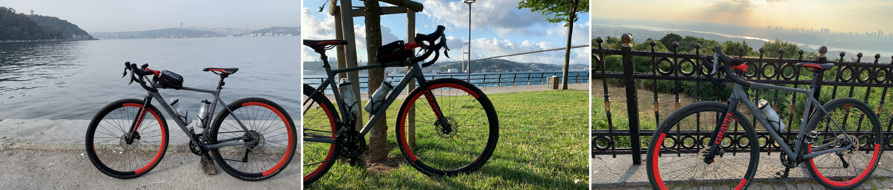

After practicing outside with nice weather, for cold weather I setup a pain-cave at my home for virtual rides on [Zwift](www.zwift.com) using [Elite Arion AL13 roller](https://www.elite-it.com/en/products/home-trainers/rollers/arion) with [Misuro B+ sensor](https://www.elite-it.com/en/products/home-trainers/sensors/misuro-b). Zwift is a virtual environment where you connect with your 3D avatar to ride with other athletes real-time.


Also my Zwift account is also connected with Strava to collect all my ride data. I’ve completed **“3700km”** so far combining outdoor and indoor activities 🎉🎉

I've decided to analyze my data and after analyzing I've decided to take this to next level with my engineering capabilities.

This repo shows how to analyze your Strava data and visualize it on Jupyter Notebook. There's another aim for this project to predict workout days and distance to find your routine using your own data. You can use this digital personal trainer as a workout companion.

First this project started as data discovery of existing bulk data on Jupyter Notebook, during data exploration phase I saw some patterns and though that, these patterns can help me to get back to my shape again. Shortly after decided to build a predictive model to predict my workout, `ride type` and  `distance`, tried to find best possible fit for prediction. To use prediction model, exported as pickle file and serve that model in Python FastAPI then a chat bot on teams using the API helped me to provide some inputs and then retrieve prediction. 

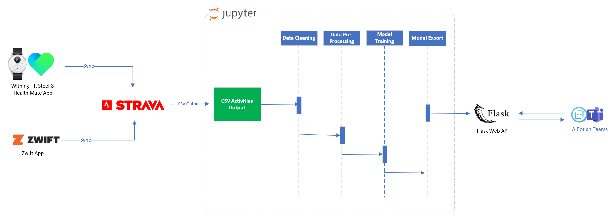

## Data Discovery - Highlights

Let's have a look at some highlights I achieved so far, here are some highlights about my data.

1. In 1 year I've completed around **3700 km** including outdoor and indoor workout activities. Around 1 of 3rd is virtual ride on Zwift.

    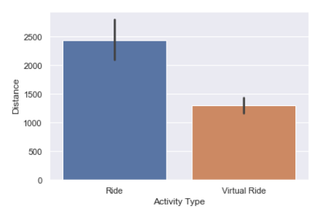

2. In 2019 I gain some fat, so after my activities and healthy food as a result I lost ~13kgs (~28lbs) during this time.

    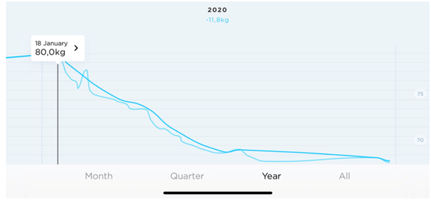

3. I love this weekly graph showcasing all important life events happened in one year. Started with a passion then lockdown due to pandemic in Turkey, then enjoying riding then new year break challenge #Rapha500, then blessed with a new family member, then trying to find my old routine again, last but not least decided to build a personal trainer.

    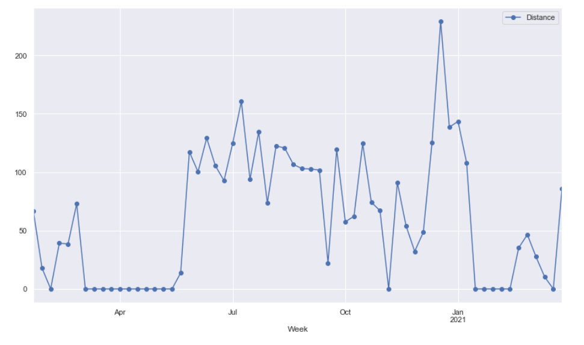

4. So far my longest distance in one ride is 62km, and I love this graph to show my performance over time.

    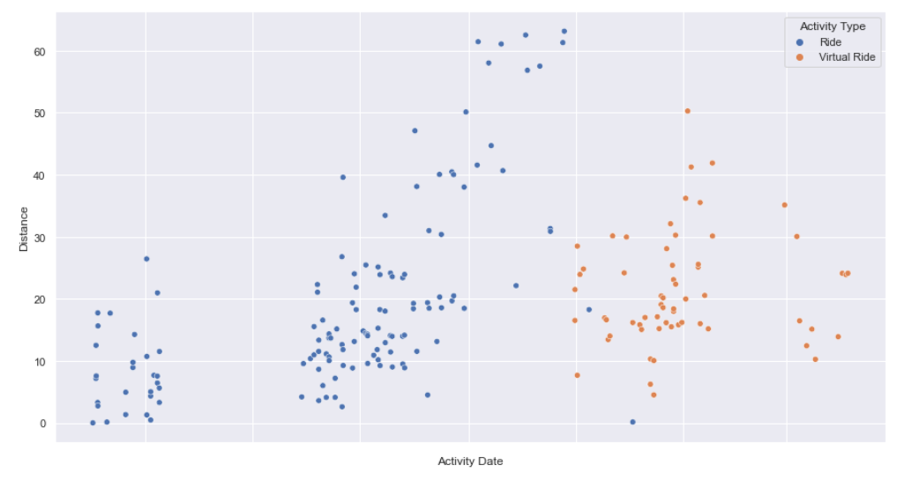

## Correlation

While I was checking ride type over time, I realized that after a point I only switched to Virtual Ride and I wanted to correlate with `Wind` and `Temperature, I used a Weather API to retrieve Weather condition during my workouts and results were clear, I don't like cycling at cold, rainy weathers, so after a point I switched back to just Virtual Rides, and below graph shows that after a certain degree I picked Virtual Ride. This is one of the features, I have added into my model for prediction.

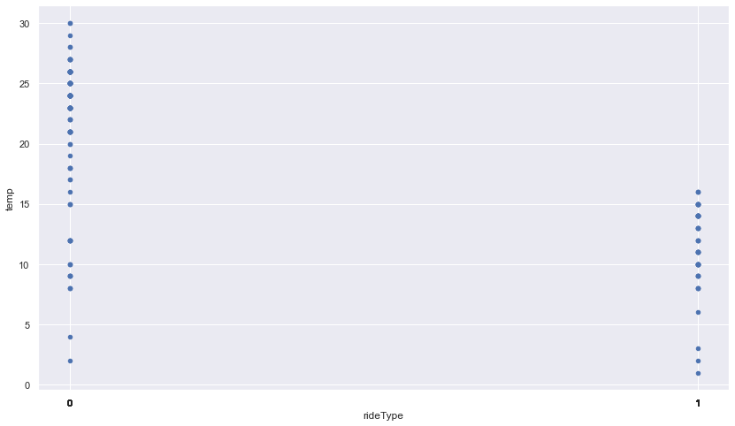

## Feature Engineering

I spent some time to visualize my ride data using Jupyter Notebook and I found some patterns. These patterns were either concious decisions by me or some decisions due to conditions.

I decided to do excercise on [Feature Engineering](https://en.wikipedia.org/wiki/Feature_engineering)

### 1. Weather condition

As mentioned in [correlation](#correlation), weather is one of the feature that effects my workout plan:

* `Temperature` - Celcius value as integer
* `Wind` - km/h value as integer
* `Weather Description` - Description if weather is cloudy, sunny, rainy etc.

### 2. Is Weekend?

When I plot distance over if it's weekend or weekdays, my longest rides were on the weekend, also public holidays were another factor but for my model however I haven't integrated those for now, I will include these into model too

  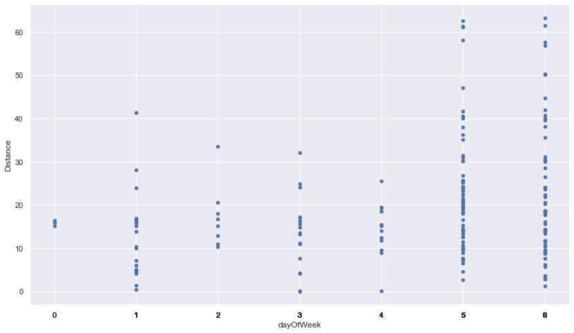

But mostly I picked Tuesday and Thursday as weekday short ride days, but there's no dominance, so decided to use weekends as flag

  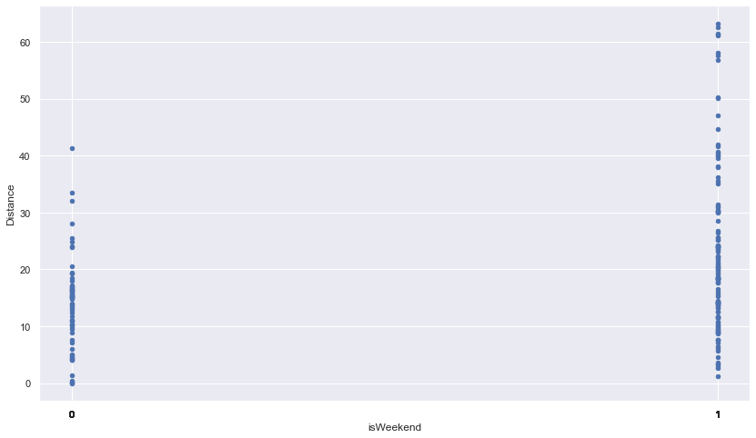

* `isWeekend` - boolean flag

## Prediction Model Traning

TBD

## Prediction Model Scoring

TBD

## Solution

TBD

Solution contains data analysis, web API and conversational AI(bot) projects.

### Architecture


Folder Structure:

* `bot` - Bot application to retrieve prediction model
* `data` - Data folder contains Strava output
* `notebooks`
  * `1 - GPX Analysis.ipynb`
  * `2 - Prepare Data.ipynb`
  * `3 - Total Distance Analysis.ipynb`
  * `4 - GPX Anlaysis Combined.ipynb`
  * `5 - GPX Analysis Visualization.ipynb`
  * `6 - Interactive Dashboard.ipynb`
  * `7 - Predict Workout Model.ipynb`
  * `8 - Predict Workout.ipynb`
  * `9 - Present.ipynb` - Highlight for data analysis and results
* `web` - FastAPI for prediction model
  * `model` - Contains models for prediction
  * `app.py` - FastAPI web app for prediction model
  * `myconfig.py` - Environmental variables
  * `utils.py` -  Common utility functions

## Run the Project

In this sample, Python 3.8.7 version is used, to run the project.

1. Create virtual environment

    ```bash
    python -m venv .venv
    ```

1. Install dependencies

    ```bash
    pip install -r notebooks/requirements.txt
    ```

1. Export your Strava Data from your profile

    * Visit [Settings > My Account > Download or Delete Your Account](https://www.strava.com/account)
    * Click `Download Request (optional)`
    * Download zip file to export into `Data` folder.

1. Create a `Data` folder and export your Strava Data into this folder.

1. Run `Jupyter Notebook` in your local

    ```bash
    jupyter notebook
    ```

## Weather API

TBD

## Python FastAPI Web Application for API

Run Python FastAPI for running on your local machine

```bash
cd web
```

```bash
python app.py
```

### Test endpoint

* Predict Ride Type & Distance

    [http://127.0.0.1:8000/predict?city=Istanbul&date=2021-04-10&time=14:00:00](http://127.0.0.1:8000/predict?city=Istanbul&date=2021-04-10&time=14:00:00)

## Publish Web App

Publish Python FastAPI to Azure Web App service

```bash
cd web

az webapp up --sku B1 --name data-driven-cycling

```

Update startup command on Azure Portal,  
Settings > Configuration > General settings > Startup Command

```bash
gunicorn -w 4 -k uvicorn.workers.UvicornWorker main:app
```

to re-deploy and update existing application:

```bash
az webapp up
```

## Test Bot Application on Local

Prerequisite:

* [.NET Core SDK](https://dotnet.microsoft.com/download) version 3.1

```bash
cd bot
dotnet run
```

Or from Visual Studio

* Launch Visual Studio
* File -> Open -> Project/Solution
* Navigate to `bot` folder
* Select `CyclingPrediction.csproj` file
* Press `F5` to run the project

Your bot service will be available at [https://localhost:3979](https://localhost:3979)

Run your Bot Framework Emulator and connect to [https://localhost:3979](https://localhost:3979) endpoint

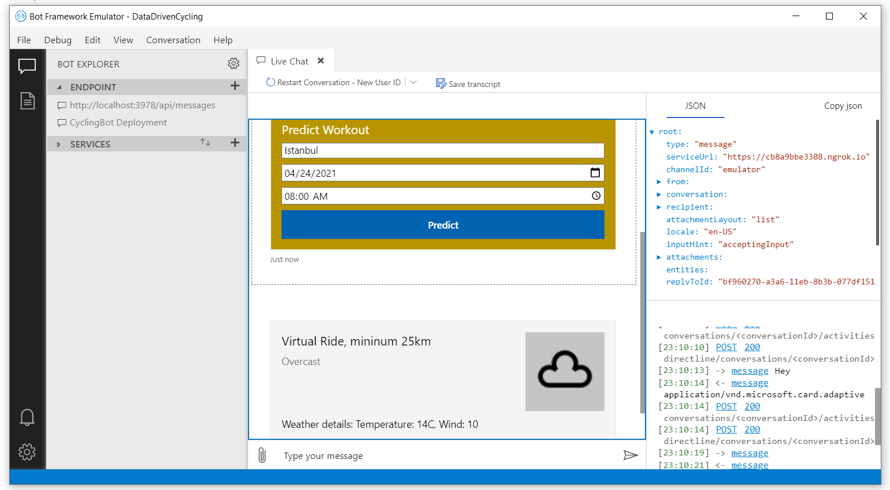

After that your bot is ready for interaction.

## Bot on Microsoft Teams

After you publish the bot you can connect with different conversational UI.
I've connected with Microsoft Teams and named as `Data Driven Cycling Bot`.

Once you send first message, it's sending a card to pick `City`, `Date` and `Time` information to predict workout ride type and minimum distance.

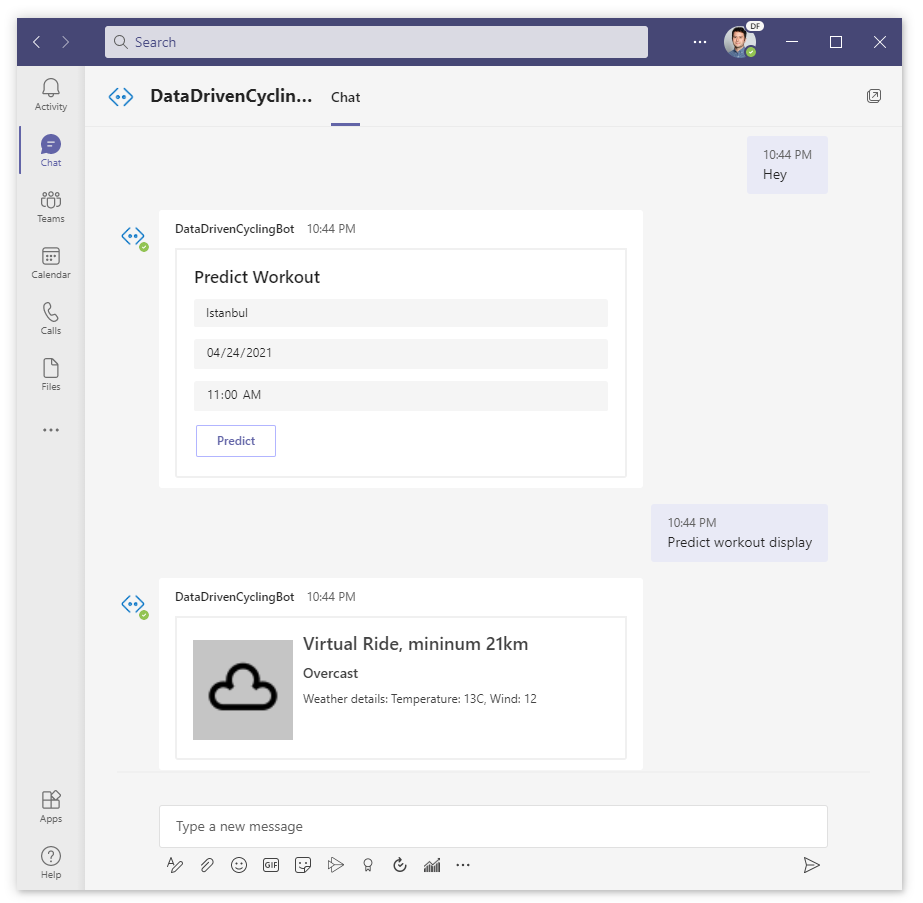